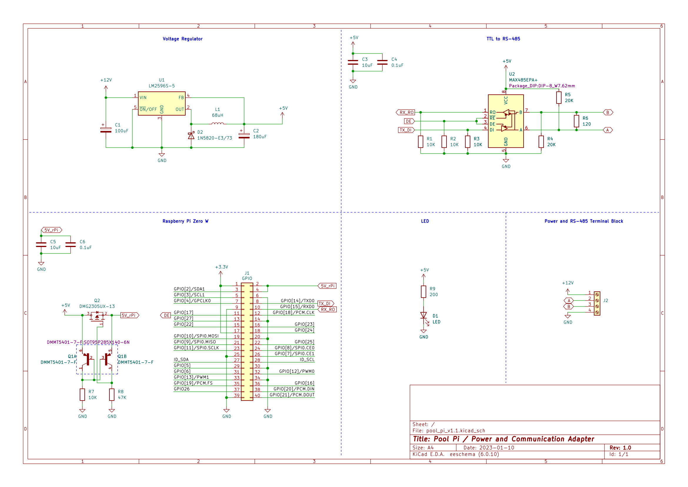

# Setup

## Project Requirements
* Goldline/Hayward Aqualogic control board (tested on Main Software Revision 2.86)
* Raspberry Pi with Wifi
* Adjustable DC-DC step down buck boost converter (or equivalent hardware)
* TTL to RS485 adapter (or equivalent hardware)
* Installation hardware:
    * Weatherproof junction box
    * Non metalic liquid tight flexible conduit
    * Concrete screws
    * Wire
    * 
* Tools:
    * Multimeter
    * Drill
    * Screwdriver

Exact parts used can be found in the [parts list](./PARTS_LIST.md).

## Software Setup
* Setup a Raspberry Pi headless with WiFi, a static IP, and SSH access [(example tutorial from Avram Piltch on Tom's Hardware)](https://www.tomshardware.com/reviews/raspberry-pi-headless-setup-how-to,6028.html).
* From a device on the same network, connect to the Pi via SSH.

        ssh pi@192.168.###.###
* Install git.

        sudo apt update
        sudo apt install git

* Install pip.

        sudo apt install python3-pip

* Install redis.

        sudo apt install redis

* Enable UART.

        sudo raspi-config
        
    From the interface, navigate to 5 Interfacting Options, P6 Serial. No login shell, Yes serial port enabled.

        sudo reboot

* Clone this repository into the home directory.

        git clone --depth 1 https://github.com/ChaseDurand/Pool-Pi.git
* Set the Pi's timezone for accurate time stamps in log file.
   * View timezone options.

           timedatectl list-timezones     
   * Set timezone.

           sudo timedatectl set-timezone YOUR_TIME_ZONE
* Run setup.sh to install python modules and configure systemd to run pool-pi.py on startup.

        sudo /home/pi/Pool-Pi/setup/setup.sh
* Confirm the status of the service.

        systemctl status poolpi.service
* Confirm log file creation.

        tail /home/pi/Pool-Pi/logs/pool-pi.log
* Complete the hardware setup steps outlined below.
* From a device on the same network, navigate to your Pi's IP address on port 5000 (ex. 192.168.###.###:5000) to access the GUI. To access the simplified GUI, add /simple.

## Hardware Setup
The system taps into the Aqualogic's power and serial busses via the 'REMOTE DISPLAY' connections on the top left of the board.
* RED 1 = ~11V
* BLK 2 = RS485 DATA A (-)
* YEL 3 = RS485 DATA B (+)
* GRN 4 = Ground 0V

  

If these are occupied, the J9 WIRELESS ANTENNA or J13 headers can be used, but the pins are laid out in a different order.

My initial prototypes used an off the shelf buck-boost converter and TTL to RS485 adapter, but I have replace them with a custom PCB that serves the same purposes.

If an adjustable DC-DC converter is used, the output needs to be set to 5V. On my RS485 adapter, read enable (RE) is innacurately labeled and is actually ~RE. If your RS485 adapter board includes pull ups on DE, they must be overriden with a pull down to prevent the board from trying to transmit while the Pi is booting, otherwise the Pi GPIO will be pulled to 5V and the Aqualogic won't boot correctly. The Raspberry Pi Zero W doesn't include a fuse on the micro USB PWR IN, which is directly tied to all 5V pins. If a different Raspberry Pi model that contains a fused power input is used, then power should be supplied through the USB port instead of a 5V pin.

   

While I had no issue with the off the shelf parts for over a year, I replaced them with a custom PCB. KiCad 6 board and schematic files can be found in [/docs/pcb](/docs/pcb).

   

Mount enclosure to exterior wall using concrete screws or appropriate fasterners. I drilled an improperly sized hole and used weatherproof sealant to fix it. Route x4 wires (x2 low voltage wires and x2 RS485) through weatherproof conduit into Aqualogic enclosure. After confirming functionality, I used construction adhesive to attach M3 metal standoffs to the inside of the enclosure.

    

   

## Troubleshooting
Communication Error can appear when multiple devices attempt to drive the serial bus simultaneously.
* Communication Err 1 (CE1) is a startup error that occurs when the local display is unable to communicate with the main control board when it powers up. This could be due to the RS485 adapter being in transmit mode on startup, as seen with CE2. Unlike CE2, this error does not clear automatically when the serial lines are cleared. To clear the error, the local display must be disconnected and reconnected. If CE1 persists after this, the main board must be power cycled via the breaker that feeds it.
* Communication Err 2 (CE2) occurs when multiple devices attempt to write to the serial bus simultaneously. Depending on the hardware configuration, this error might occur when the Pool-Pi is powered off due to the RS485's state when powered off. To fix this, ensure that the RS485 adapter is set to receive when not transmitting.
