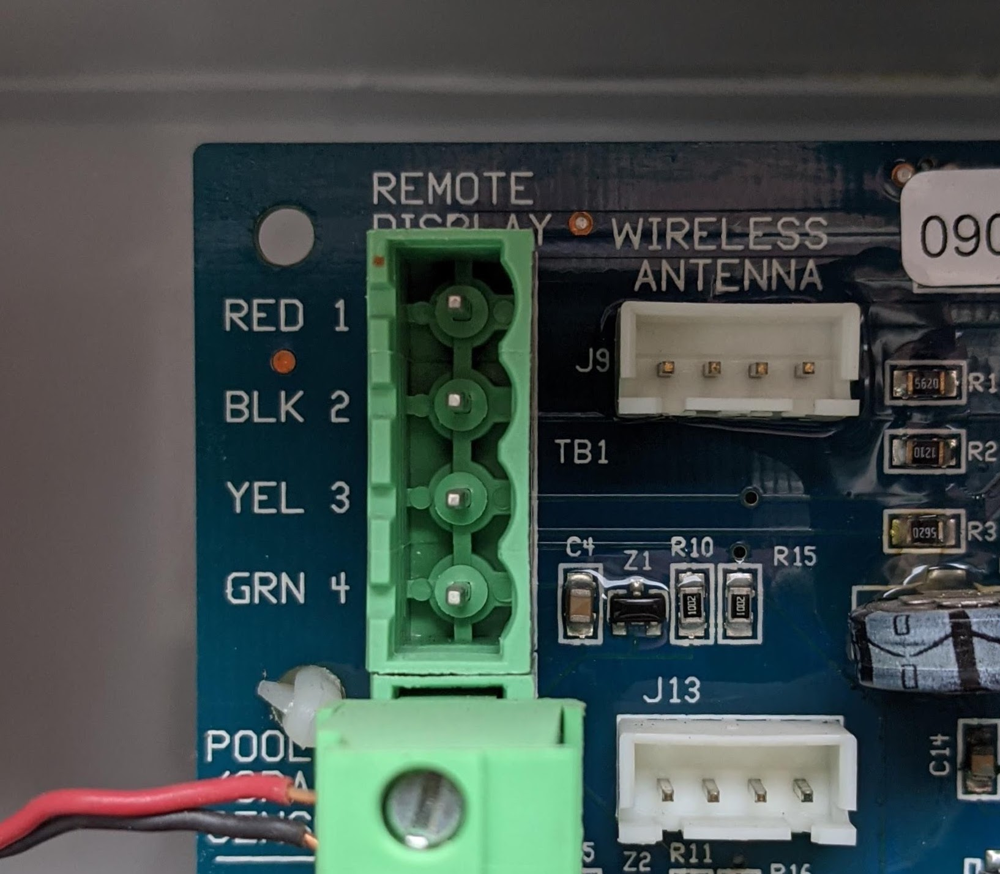
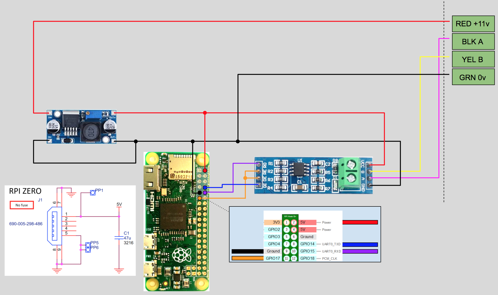
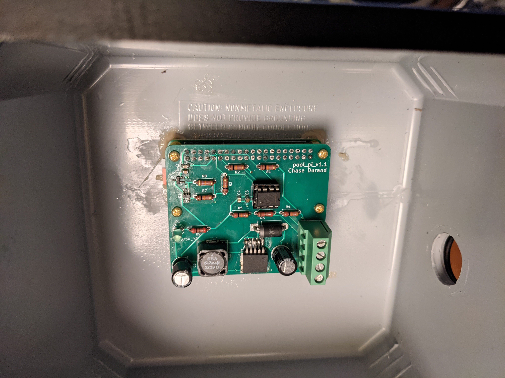
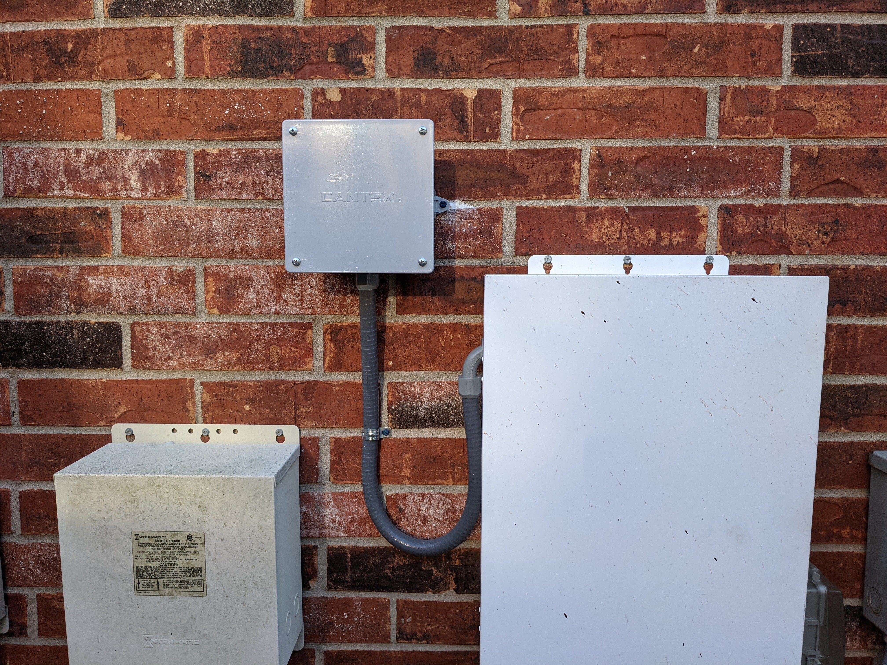

# Setup

## Project Requirements
* Goldline/Hayward Aqualogic control board (tested on Main Software Revision 2.86)
* Raspberry Pi with Wifi
* Adjustable DC-DC step down buck boost converter
* TTL to RS485 adapter
* Installation hardware:
    * Weatherproof junction box
    * Non metalic liquid tight flexible conduit
    * Concrete screws
    * Wire
* Tools:
    * Multimeter
    * Drill

Exact parts used can be found in the [parts list](./PARTS_LIST.md).

## Software Setup
* Setup a Raspberry Pi headless with WiFi, a static IP, and SSH access [(example tutorial from Avram Piltch on Tom's Hardware)](https://www.tomshardware.com/reviews/raspberry-pi-headless-setup-how-to,6028.html).
* Connect to the Pi via SSH and clone this repository.

        git clone --depth 1 git@github.com:ChaseDurand/Pool-Pi.git
* Navigate to repo and install requirements.

        cd Pool-Pi
        pip3 install -r src/requirements.txt
* Complete the hardware setup steps outlined below.
* Run pool-pi.py.

        python3 src/pool-pi.py
* From a device on the same network, navigate to your Pi's IP address on port 5000 (ex. 192.168.###.###:5000) to access the GUI.
<!-- TODO configure GUI to match local aqualogic system -->

## Hardware Setup
The system taps into the Aqualogic's power and serial busses via the "REMOTE DISPLAY" connections on the top left of the board. If these are occupied, the J9 WIRELESS ANTENNA or J13 pins can be used.
* RED 1 = ~11V
* BLK 2 = RS485 DATA A (-)
* YEL 3 = RS485 DATA B (+)
* GRN 4 = Ground 0V

  

Connect the DC-DC converter to the ground and 11V pins on the Aqualogic and adjust the converter output to 5V. Make the connections as shown below. On my RS485 adapter, read enable (RE) is innacurately labeled and is actually ~RE. The Raspberry Pi Zero W doesn't include a fuse on the micro USB PWR IN, which is directly tied to all 5V pins. If a different Raspberry Pi model that contains a fused power input is used, then power should be supplied through the USB port instead of a 5V pin.   

   

Mount DC-DC converter, Raspberry Pi, and RS485 adapter inside weather proof enclosure using mil-spec cardboard and hot glue. I mounted the DC-DC converter and RS485 adapter on a solderable breadboard for ease of wiring and attached M3 standoffs under the breadboard and Raspberry Pi.

    

Mount enclosure to exterior wall using concrete screws or appropriate fasterners. Use weatherproof sealant to fix the improperly sized hole you drilled. Route x2 low voltage wires and x2 RS485 wires through weatherproof conduit into Aqualogic enclosure. Enter service mode by pushing the red service button on the local display, then connect the wires to the appropriate Aqualogic pins. Push the service button twice to exit service mode and return to normal operation.

   

## Troubleshooting
Communication Error can appear when multiple devices attempt to drive the serial bus simultaneously.
* Communication Err 1 (CE1) is a startup error that occurs when the local display is unable to communicate with the main control board when it powers up. This could be due to the RS485 adapter being in transmit mode on startup, as seen with CE2. Unlike CE2, this error does not clear automatically when the serial lines are cleared. To clear the error, the local display must be disconnected and reconnected. If CE1 persists after this, the main board must be power cycled via the breaker that feeds it.
* Communication Err 2 (CE2) occurs when multiple devices attempt to write to the serial bus simultaneously. Depending on the hardware configuration, this error might occur when the Pool-Pi is powered off due to the RS485's state when powered off. To fix this, ensure that the RS485 adapter is set to receive when not transmitting.
